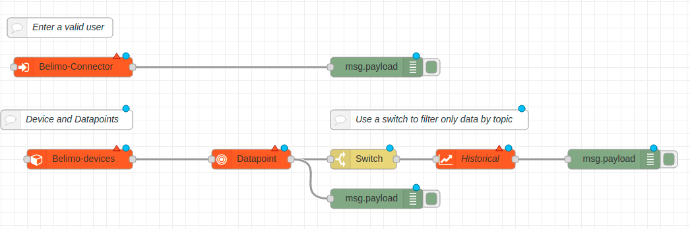

# node-red-contrib-belimo-cloud

> NODE-RED Belimo-Cloud Library by MST Systemtechnik AG.

## Overview

This node allows Node-RED developers to quickly build a connection to the [Belimo-Cloud](https://www.belimo.com/iot/developers) for accessing data with the cloud-api. The data can then be displayed in a dashboard, or can be distributed to other systems. 

## Installation and Usage

1. Go to your Node-RED users directory and run: `npm install node-red-contrib-belimo-cloud`
2. Start Node-RED
3. Drag-in a belimo-connector and create a oauth configuration
4. Enter a valid username and password for the belimo-cloud
5. Deploy and check the status
6. When the connection is established, then it's ready to use


## Debug

To set the debug-mode, use following commands.

```
Linux
DEBUG=belimo-cloud:*

PowerShell
$env:DEBUG = "belimo-cloud:*"

CMD
set DEBUG=belimo-cloud:*

```

### Nodes

- Belimo-Connector
- Belimo-Device
- Belimo-Datapoint
- Belimo-Historical
- Belimo-FindDevice

The output of the nodes ar labeled with a `msg.topic` property. Check the Node-Information in the Node-Red-Editor.

#### Belimo-Connector

Uses oauth for the authentification. Theses parameters should be requested from Belimo.
- Client-ID
- Client-Secret
- Username
- Password

When the login-parameters should be inserted on the frontend, connect the form-inputs to the connector with the topics `username` and `password`. To send a login or logout event, emit a message with the topics `login` or `logout`.

#### Belimo-Device

Reads all devices and write them to the output. Connect a ui-dropdown to display the devices in the frontend. To send a device to the output, select one in the dropdown, or emit a message with the topic `deviceId`.

#### Belimo-Datapoint

Reads the dataprofile from the device and write them to the output. Connect a ui-dropdown to display the datapoints in the frontend. When no device is present, just type in the `reference` like `/energyvalve3/1.2` for your specific device and select the datapoint in the dropdown.
It will start a subscription, when a datapoint is selected or when one is found by a emitted message with the topic `datapointId`.

To write the selected datapoint, simple connect a ui-input, set the topic to `write` and enter the values in the frontend. Please check if the datapoint is writable.
It's possible to write multiple values. Please check the Node-Information for the object-structure.

#### Belimo-Historical

Reads the historical data from the connected datapoint. It has following parameters: `resolution`, `from` and `to`. To display live-data, just clear the `from` and `to` parameters.
Please check the Node-Information for the object-structure of the `from` and `to` parameters.

#### Belimo-FindDevice

Use this node for searching a device by serial-number.


### Example flow

Below is an example flow that shows how to use the library. The Belimo-Connector handles the connection to the cloud. This connection will be used in any other node. To read a datapoints simple insert a Device-Node, connect it to a Datapoint-Node and deploy it. After that, it's possible to select a device in the Device-Node and a Datapoint in the Datapoint-Node. It has more examples in the `./node-red-contrib-belimo-cloud/examples` folder.

#### Example Dependenices
- dynamic_frontend.json - `npm i node-red-dashboard`





```
[{"id":"25d40e41.ce4ac2","type":"tab","label":"Flow 1","disabled":false,"info":""},{"id":"cc525d23.08d2f","type":"comment","z":"25d40e41.ce4ac2","name":"Device and Datapoints","info":"","x":120,"y":220,"wires":[]},{"id":"e1908d2f.c6156","type":"switch","z":"25d40e41.ce4ac2","name":"","property":"topic","propertyType":"msg","rules":[{"t":"eq","v":"data","vt":"str"}],"checkall":"true","repair":false,"outputs":1,"x":750,"y":320,"wires":[["a0475d8.67038a"]]},{"id":"fcdbfc58.cf1a3","type":"comment","z":"25d40e41.ce4ac2","name":"Use a switch to filter only data by topic","info":"","x":830,"y":220,"wires":[]},{"id":"313ff1fa.63d2be","type":"comment","z":"25d40e41.ce4ac2","name":"Enter a valid user","info":"","x":110,"y":60,"wires":[]},{"id":"b901b0ea.12b5b","type":"debug","z":"25d40e41.ce4ac2","name":"","active":true,"tosidebar":true,"console":false,"tostatus":false,"complete":"false","x":590,"y":120,"wires":[]},{"id":"40562991.900338","type":"debug","z":"25d40e41.ce4ac2","name":"","active":true,"tosidebar":true,"console":false,"tostatus":false,"complete":"false","x":590,"y":380,"wires":[]},{"id":"5d25a749.875f68","type":"debug","z":"25d40e41.ce4ac2","name":"","active":true,"tosidebar":true,"console":false,"tostatus":false,"complete":"false","x":1130,"y":320,"wires":[]},{"id":"48c07ee2.ded92","type":"belimo-connector","z":"25d40e41.ce4ac2","name":"","oauth":"","x":130,"y":120,"wires":[["b901b0ea.12b5b"]]},{"id":"52aa7674.4e8f68","type":"belimo-devices","z":"25d40e41.ce4ac2","name":"","oauth":"","device_id":"","x":140,"y":320,"wires":[["b316f753.46cec8"]]},{"id":"b316f753.46cec8","type":"belimo-datapoint","z":"25d40e41.ce4ac2","name":"","oauth":"","reference":"","dataprofile_value":"","x":400,"y":320,"wires":[["e1908d2f.c6156","40562991.900338"]]},{"id":"a0475d8.67038a","type":"belimo-historical","z":"25d40e41.ce4ac2","oauth":"","resolution":"15m","from_date":"","from_time":"","to_date":"","to_time":"","x":920,"y":320,"wires":[["5d25a749.875f68"]]}]
```


## Authors

* **MST Systemtechnik AG, Yannick Grund** - *Initial work* - [https://www.mst.ch/](https://www.mst.ch/)


## License

This project is licensed under the MIT License - see the [LICENSE.md](LICENSE.md) file for details
